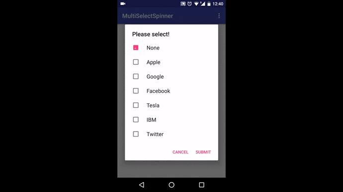

This is a multi-selection spinner where you can add a 'None' option as well.
&nbsp;

The spinner supports following methods:

<ol>
<li>setItems(): Set adapter items using an array/list of strings.</li>
<li>setSelection(): Set selected items on the spinner. You can pass either of the following parameters:
<ul>
    <li>Array of strings</li>
    <li>List of strings</li>
    <li>(int) index of the selection</li>
    <li>(int) array of indexes</li>
</ul></li>
<li>getSelectedStrings(): Get the selected items as a string. Retrun type is a List.</li>
<li>getSelectedIndices(): Get the selected indexes as a List of integers.</li>
</ol>

<h4>None Option</h4>

None option can be included by setting the property 'hasNoneOption' as true.
 

<b>This does not add the 'None' item to the spinner.</b> You will have to add that manually to your array/List while setting up the adapter. This allows you to control the text of the 'none' option. The first item in the array/list will be considered for the 'none' option. you can add any string for this item: None, [Select One], etc.

